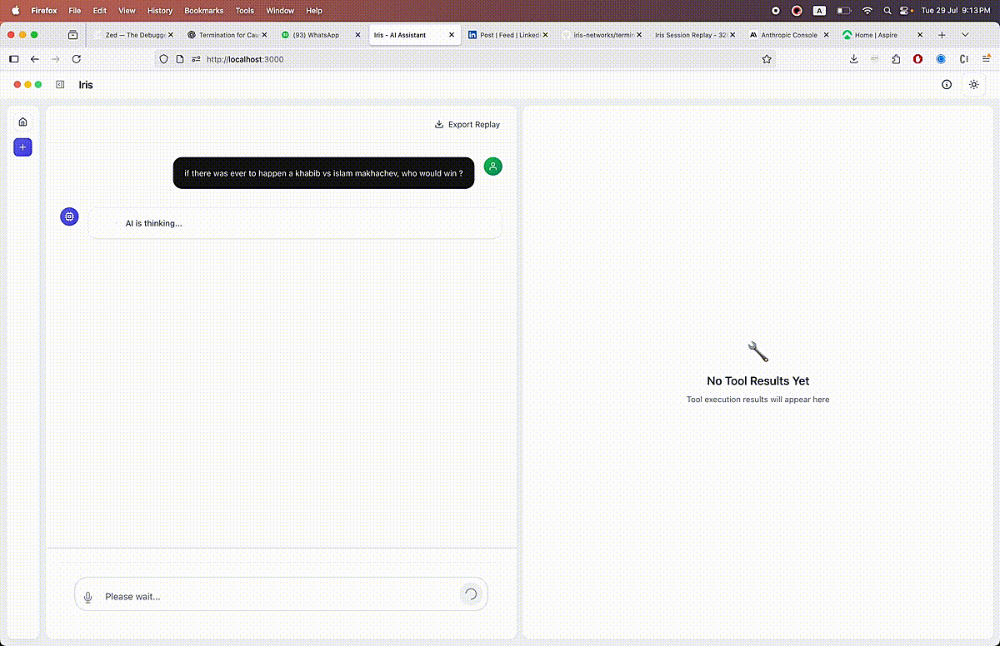
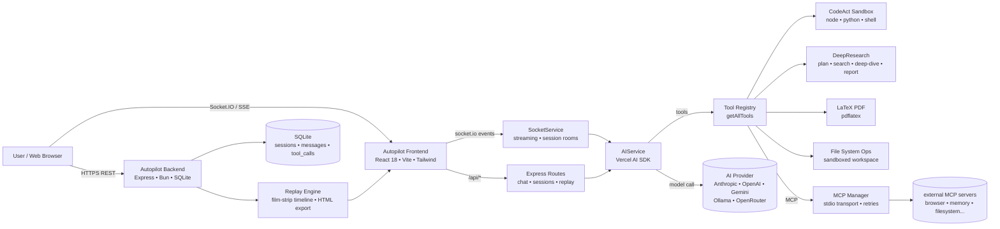
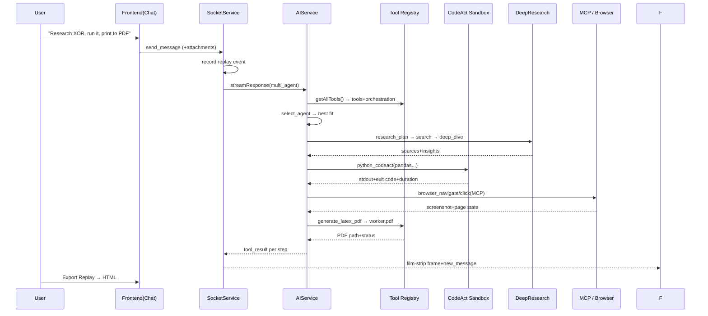

<div align="center">

  

  <h1 align="center">🤖 Autopilot</h1>

  <p align="center">
    <b>The AI Automated Software Engineering Platform</b><br/>
    <b>Set the destination. It flies the plane.</b>
  </p>

  <p align="center">
    
    
    
    
    
    
  </p>

  <p align="center">
    
    
    
    
    
    
    
    
    
    
    
    
    
    
    
    
  </p>

</div>

---

## 📖 Table of Contents

- [What Is Autopilot?](#what-is-terminator)
- [The Problem We Are Solving](#the-problem-we-are-solving)
- [Why We Built This — The Origin Story](#why-we-built-this---the-origin-story)
- [How We Built It — The Engineering Story](#how-we-built-it---the-engineering-story)
- [The "Best Automated Software Engineering" Case](#the-best-automated-software-engineering-case)
- [The Best of What's Inside](#the-best-of-whats-inside)
- [Architecture](#architecture)
- [Tech Stack](#tech-stack)
- [Getting Started](#getting-started)
- [AI Providers](#ai-providers)
- [Configuration Reference](#configuration-reference)
- [Docker Deployment](#docker-deployment)
- [Compile to a Standalone Binary](#compile-to-a-standalone-binary)
- [NPM Scripts](#npm-scripts)
- [Project Structure](#project-structure)
- [API Overview](#api-overview)
- [Documentation](#documentation)
- [Roadmap](#roadmap)
- [License](#license)

---

## 🔍 What Is Autopilot?

> **Autopilot is an open-source, self-hosted AI software-engineering copilot.** It fuses a multi-agent reasoning system, a sandboxed code execution engine, a vision-capable browser automation layer, deep web research, and a cinematic "film strip" tool-result workspace into a single web application. One natural-language request can turn into working code, a compiled PDF, a researched report, or a completed browser task — all inside one session.




### The shortest description

| Term | Does |
|---|---|
| 🧠 **Agent orchestration** | A `multi_agent` brain that picks the right specialist (CodeAct, DeepResearch) per task and can coordinate them |
| ⚡ **CodeAct engine** | Run real **JavaScript / Node.js, Python, and Shell** in isolated sandboxes with one-line dependency management (`npm` / `pip`and persisted memory) |
| 🔬 **DeepResearch engine** | Plan-and-execute research across DuckDuckGo/Google/Bing with source tracking, insight extraction,and auto-generated reports |
| 🌐 **Browser automation(MCP)** | Full vision-capable browser control via Model Context Protocol servers (`browser`, filesystem, memory,…`) — click, type, drag, hover, wait, extract,screenshot |
| 📄 **LaTeX PDF pipeline** | Turn plain LaTeX into a downloadable/inline-rendered PDF with zero extra tooling |
| 🎞️ **Session replay** | Every tool call is recorded into a film-strip timeline — scrub back,replay,and export a full self-contained **HTML replay** |
| ⚡ **Real-time UX** | Streaming tokens via **Socket.IO + SSE**, file attachments,dark mode,glassmorphism UI,Monaco editor,Framer Motion |


---

## ❗ The Problem We Are Solving

Every student, hackathon team,and startup engineer hits the same wall. The software-engineering loop is **broken across ten disconnected tools**:

| # | Problem | What hurts | How Autopilot fixes it |
|---|---|---|---|
| 1 | **Agents talk, but they don't *do*** | Chatbots stop at the text — no files written, no code run, no artifacts produced | Every capability is a **tool that executes** and streams its real result back — web pages fetched, code compiled,PDFs generated |
| 2 | **Running AI code is dangerous** | Copy-paste into a terminal, guess dependencies,pollute your machine | **Sandboxed workspace** with path-traversal guards,dangerous-command blocking,per-language isolation,auto dependency install,timeouts,real-time streamed output |
| 3 | **Research is shallow & unverifiable** | One hallucinated paragraph,no sources,no structure | **Plan-and-execute research loop**:structured plans,multi-engine searches with domain filters,multi-source visits,insight extraction,source tracking,cited reports |
| 4 | **Browsers are the real computer interface — but brittle** | Scraping breaks,headless automation opaque,fragile selectors | **Vision-capable browser control via MCP** — visual steps with screenshots&mouse overlays,reconnect/backoff,health checks |
| 5 | **You can't see what the agent is doing** | Black-box agents feel untrustworthy — judges&users can't verify work | **Film-strip Workspace panel** renders every tool result as a contextual card behind playback controls;export **standalone HTML replays** for demos&judges |
| 6 | **Deploying AI software is a pain** | Runtimes,dependencies,browser binaries,secrets in `ps` | Ships as a **single compiled Bun binary**,a **Docker WebTop desktop app**,and `start-server.sh` that feeds API keys via stdin |

### So — the problem,in one breath:

> **Software-engineeringwith AI shouldn't be a scavenger hunt across ten tools. It should be one self-hosted platform where an agent does the *whole* engineering loop — plan, search, browse, write, execute,generate artifacts,and replay it all — transparently,and verifiably.**

---

## 🌱 Why We Built This — The Origin Story

We kept watching the same pattern repeat:brilliant ideas stalled at the gap between *"The model knows how"* and *"The computer did it"*. Frameworks demos stopped at chat bubbles. Engineering is **effects** — files created,processes run,pages visited,artifacts shipped. Everything else is theater.

 So we set out to build the **missing operating system for AI software engineering**:a single workspace where the model's intent becomes machine state you can see,replay,and trust. Three design convictions shaped everything:

- 💬 **One conversation = one work session**
- 🛠️ **Every answer = a real executed tool**
- 🎞️ **Every action = a replayable film frame**
- 📦 **One artifact = a shippable binary**

---

## 🛠️ How We Built It — The Engineering Story

Building a platform where an LLM can safely *drive a computer* meant solving eight hard engineering problems. Here's the honest breakdown:

### 1️⃣ Agent orchestration — the brain that delegates

We didn't want one generic agent failing at everything. `AgentTARS.ts` defines **agent archetypes** with explicit capability maps(`AGENT_CAPABILITIES`)and specialization lists. A `select_agent` tool classifies every incoming task by keywords and picks the best specialist; `switch_agent` preserves conversation context;and `coordinate_agents` builds a **dependency-graph execution order** so subtasks run in the right sequence even with dependencies. Result:one assistant that *looks* general but internally routes to specialists — exactly how a real engineering team operates.

### 2️⃣ The CodeAct sandbox — safe,real execution

The riskiest part of letting an LLM "run code" is trust. Our design remade this as a **sandboxed subprocess service**:

- **Per-language isolation**: separate `node/`, `python/`, `shell/` workspaces inside a `CODEACT_WORKSPACE`.
- **Just-in-time dependencies**: `npm install pkg` / `pip install pkg` before execution,with longer install timeouts.
- **Hard guards**: dangerous-command blacklist(`rm -rf /`, `dd`, `fork bombs`…),timeouts with SIGTERM→SIGKILL escalation,exit codes,duration metadata.
- **Persistent memory**:a key/value store keyed by name so the agent remembers scripts,data,and outputs across turns —the beginning of an agent-native filesystem.

### 3️⃣ DeepResearch — verify,don't hallucinate

We replaced single-shot "answer generation" with a **plan-and-execute research protocol**:

- Multi-engine search(DuckDuckGo,Google,Bing)with `site:` filters,and `-site:` exclusions,and relevance scoring.
- `deep_dive` visits top sources,extracts insights **by focus area**,tracks every URL,and dedupes insights.
- `report_generator` assembles a cited reportin Markdown,HTML,or JSON —with metadata(sources visited,images collected,generation time.
- Research sessions are first-class citizens:`session_manager` lists,inspects,and deletes them with live stats.


### 4️⃣ MCP browser layer — vision-grade web automation without the pain

Ra ther than hand-rolling fragile selectors,we built on the **Model Context Protocol**,the open standard rushing through the industry. `MCPManager` handles the full connection lifecycle:stdio transport,exponential-backoff reconnects,retry caps,per-server timeouts,health checks,and a config kill-switch. The bundled default — `@agent-infra/mcp-server-browser --vision` — gives the agent **vision-based** browser control. Because MCP tools plug into the same Zod-validated tool registry,the agent seamlessly mixes browser actions with code execution,and research in one plan.

### 5️⃣ Replay engine — every tool call becomes film

Engineers trust what they can *watch happen*. `SocketService` records a timestamped event stream per session(`user_message`, `assistant_thinking`, `assistant_message`, `tool_call`). That stream powers:

- the **film-strip Workspace panel** — every tool result becomes a frame with a dedicated renderer;
- **`GET /api/replay/sessions/:id/replay`** — a JSON timeline;

- **`GET /api/replay/sessions/:id/export`** — a **self-contained HTML replay** with an embedded React+Tailwind timeline you can download,send to a judge,or demo offline.

### 6️⃣ Streaming UX — latency is a feature to design for

LLM generation is slow,so slow is death. We built a dual streaming path:**Socket.IO** events for the web app,and **SSE** for the REST API. Tokens stream,tool results stream,even the *thinking state* streams as animated dots. It feels alive because it *is* alive — every frame of the agent's work arrives the moment it happens.

### 7️⃣ SQLite persistence — sessions,messages,tool calls

Conversations are worthless if they vanish on restart. `DatabaseService` models three tables(`sessions`, `messages`, `tool_calls`with FK cascade deletes),four indexes,and `SessionService` layers a memory cache on top with auto-generated titles from the first user message. Sessions survive restarts,and the sidebar instantly regroups them by **Today / Yesterday / This Week**.

### 8️⃣ Ship it everywhere — binary,Docker,CI

"Works on my machine" wasn't acceptable. Three deployment stories:

- **Standalone binary**: `bun build --compile` embeds the entire backend into one executable per target. No Node.js install required.
- **Docker WebTop**:the `docker-compose.yml` spins up a full **Linux desktop in the browser**(KDE)with Autopilot installed as a desktop app + Chromium preinstalled for MCP browser tools.
- **CI release pipeline**: `.github/workflows/release.yml` fires on every `main` push — builds the frontend,compiles **4 binaries** ona matrix,and attaches them to an auto-incremented GitHub Release. Push to main = software released.

### The hard-won lessons

- 🤖 **Give agents a filesystem,not just a prompt**
- 🛡️ **Trust is engineered:sandbox,blacklist,validate**
- 🎞️ **Replayability is what makes AI feel *safe***
- 📦 **Compile everything — deployment is UX too**

---

## 🏆 The "Best Automated Software Engineering" Case

Judges ask three questions:**Substance, Execution, Business.** Here's how Autopilot answers each — by design,not by accident:

###Substance — real problem,deep attempt

| Criterion | Autopilot's answer |
|---|---|
| **Strength of problem** | The AI-engineering gap:models reason but can't *do*. We scaffolded the missing **effects layer** — sandboxed execution,real browser control,artifact generation. |
| **Originality** | Not a chatbot wrapper:,a **multi-agent orchestration + tool-execution + replay workspace** —the "film strip" timeline you can scrub,and export as HTML |
| **Technical depth** | Eight hard systems in one repo:agent selection&coordination,sandboxed languages w/ auto-deps,plan-and-execute research,MCP lifecycle mgr,replay engine,dual streaming,SQLite schema design,multi-target compile+CI releases. |

### Execution — quality of build & UX

| Criterion | Autopilot's answer |
|---|---|
| **Functionality** | It *does* things:runs Node/Python/Shell,browseswith vision,researches w/ citations,generates PDFs — all streamed live into a three-panel IDE-like workspace. |
| **Implementation** | TypeScript strict throughout;every tool parameter **Zod-validated**;path-traversal guards;dangerous-command blacklists;CSP via Helmet;graceful shutdown;error handlers. |
| **UX & demonstration** | Thinking dots,gradient focus ring,connection banner,dark/light themes,Monaco editor,film-strip playback w/ speed control,and **one-click HTML replay export** — a built-in demo delivery mechanism. |

### Business — why it matters in the real world

| Criterion | Autopilot's answer |
|---|---|
| **Target user** | Students automating homework,hackathon teams needing a research+code copilot,indie hackers shipping scripts,anyone who wants a self-hosted agentthat actually *does work* on their own machine. |
| **Real-world potential** | An **open platform with pluggable MCP servers** — today browser;tomorrow GitHub,Slack,Postgres,Kubernetes. The same architecture scales from local hacking to production automation. |
| **Why it matters** | As agents get smarter,the bottleneck shifts from *reasoning quality* to *safe,observable,effectful action*. Autopilot is a working answer to that bottleneck — and it runs anywhere(binary,Docker,desktop. |

---

## 🌟 The Best of What's Inside

### 🧠 Multi-Agent Orchestration

- Three agent archetypes:**AI Assistant**(all tools),**CodeAct Agent**(sandboxed code),**DeepResearch Agent**(plan-and-execute research.
- Automatic agent selection by task keywords,plus explicit tools to `select_agent`, `list_agents`, `switch_agent`(with context preservation),and `coordinate_agents`(dependency-graph execution ordering for sequential/parallel/dependency modes).

###⚡ CodeAct Sandbox

```ts
node_codeact:   run Node.js/JS  + `npm install` deps
python_codeact: run Python       + `pip install` packages
shell_codeact:  run bash/sh/zsh  + dangerous-command blocking
codeact_memory: persistent key/value memory across sessions
```

- Real-time stdout/stderr streaming,timeouts,exit codes,duration metadata,auto-installed dependencies,isolated per-language workspaces,and Monaco-based renderer with copy buttons.

###🔬 DeepResearch Engine

- `research_plan`:create/update/get research plans&sessions.
- `search`:DuckDuckGo/Google/Bing with domain `site:` filters,and `-site:` exclusions,relevance scoring,instant-answer support.
- `visit_link` / `deep_dive`:multi-source analysis with focus-area insight extraction,and URL deduplication.
- `report_generator`:**Markdown / HTML / JSON** reports from collected sources+images.
- `session_manager`:list / inspect / delete research sessions with stats.

### 🌐 Vision-Capable Browser Automation(MCP)

- Driven by the **Model Context Protocol** — connect any MCP server;
- Bundled default:`@agent-infra/mcp-server-browser --vision`.
- **21+ specialized renderers** for browser results:click/double-click/right-click,hover,drag&drop,form fill/type,wait,extract/text/links/clickable-elements — each shown as a visual step.

### 🛠️ General Toolkit

- `web_search`(enhanced), `visit_link`(readability-extracted content via Turndown/Mozilla Readability), `file_read` / `list_files` / `create_directory`(sandboxed workspace), `execute_command`(shell selection,timeouts,security blocks), `generate_latex_pdf`(compiles `pdflatex` → PDF served at `/api/pdf/:name`).

### 🎛️ Live IDE-Like Workspace Panel

- Three-panel layout:**Recent Tasks sidebar**,**Chat**,**Workspace/Computer**(film-strip timeline of tool results with playback controls,per-frame renderers.
- Gradient focus border on input,animated thinking dots,connection status banner,one-click **Export Replay**.

### 📼 Session Replay&Export

- Every `user_message`, `assistant_thinking`, `assistant_message`,and `tool_call` is recorded per session.
- Replay API:`GET /api/replay/sessions/:id/replay`(JSON)and `/export`(self-contained HTML with embedded data+timeline UI).
- Sessions persist in **SQLite**(`data/sessions.db`)with indexes on session/message/tool-call,and cascade deletes. Auto-generated titles from first message.

### 🛡️ Security-First Design

- Path validation — no directory traversal out of `workspace/`.
- Dangerous command blacklist(`rm -rf /`, `dd`, `mkfs`, `fork bomb`,…).
- Helmet CSP headers+CORS allow-listing.
- Sanitized PDF filenames,403 on escape.
- MCP connections with exponential backoff reconnect,max-retry caps,timeouts,health checks,and kill-switch.
- `start-server.sh` feeds env vars via stdin temp file — **API keys never visiblein process listings**.

### 🎨 Modern,Polished UI

- React 18+TypeScript+Vite+Tailwind,React Router(shareable `/sessionId` URLs,dark/light theme with `next-themes`,Framer Motion animations,Monaco editor,react-markdown+GFM+rehype-highlight,glassmorphism panes,macOS traffic-light header,gradient accent system.


---

## 🏗️ Architecture

###System Overview



### Multi-Agent Orchestration



### Repository Layout


---

## 🛠️ Tech Stack

| Layer | Technologies |
|---|---|
| **Language** | TypeScript (strict), ESM |
| **Runtime / Tooling** | Bun ≥ 1.0, Node ≥  18, pnpm workspaces |
| **Backend** | Express 4, Socket.IO 4, Helmet, CORS, Vercel AI SDK, @ai-sdk/{openai,anthropic,google}, @openrouter/ai-sdk-provider, ollama-ai-provider |
| **Sandbox execution** | child_process spawn with timeouts, isolated workspaces, auto npm / pip installs |
| **Database** | SQLite via bun:sqlite (sessions,messages,tool_calls with indexes) |
| **Research** | DuckDuckGo Instant Answer API, Mozilla Readability, Turndown (HTML→Markdown), jsdom |
| **Browser / MCP** | @modelcontextprotocol/sdk, @agent-infra/browser, stdio transport, puppeteer |
| **PDF** | pdflatex (LaTeX → PDF), streamed via Express |
| **Frontend** | React 18, Vite 7, Tailwind CSS 3, Framer Motion, react-router-dom, jotai, react-markdown, react-syntax-highlighter, Monaco Editor, socket.io-client, next-themes |
| **Validation** | Zod schemas on every tool parameter |
| **Deploy** | Docker (WebTop desktop), Bun --compile standalone binaries, GitHub Actions release pipeline |

---

## 🚀 Getting Started

### Prerequisites

- **[Bun](https://bun.sh/docs/installation)** ≥ 1.0 (runtime + package manager + bundler)
- **Node.js** ≥ 18
- **One AI provider API key** (Anthropic, OpenAI, Google, OpenRouter — or a local Ollama server)
- *(optional)* pdflatex for the LaTeX PDF tool

### 1. Clone

```bash
git clone https://github.com/robloxsagax-web/Autopilot.git
cd Autopilot
```

### 2. Install dependencies

```bash
bun install
```

> Workspaces(frontend,backend)install together. On resource-constrained CI you can skip the Chromium download: `PUPPETEER_SKIP_DOWNLOAD=true bun install`.

### 3. Configure environment

```bash
cp.env.example.env
```

Minimal Anthropic example:

```bash
AI_MODEL=claude-sonnet-4-20250514
AI_PROVIDER=anthropic
ANTHROPIC_API_KEY=sk-ant-..
```

### 4. Start

```bash
bun run dev:watch
```

That runs the backend(`bun --watch`,port **3001**)and hot-rebuilds the frontend into `backend/public`,served by the same Express server.

### 5. Open the app

| URL | What |
|---|---|
| http://localhost:9005 | Frontend dev server (Vite proxy → backend) |
| http://localhost:3001 | Backend API + Socket.IO + served frontend |
| http://localhost:3001/health | Health check |

**Ports:** backend `PORT` (default `3001`), frontend dev `9005`, WebTop Docker desktop `6901`.

### Quick smoke test

```bash
curl http://localhost:3001/health
```

---

## 🧠 AI Providers

| Provider | `.env` |
|---|---|
| **Anthropic Claude** | `AI_PROVIDER=anthropic` · `AI_MODEL=claude-sonnet-4-20250514` · `ANTHROPIC_API_KEY=...` |
| **OpenAI GPT** | `AI_PROVIDER=openai` · `AI_MODEL=gpt-4o` · `OPENAI_API_KEY=...` |
| **OpenAI-compatible (LiteLLM / vLLM / LocalAI)** | add `OPENAI_BASE_URL=http://host:4000` |
| **Google Gemini** | `AI_PROVIDER=google` · `AI_MODEL=gemini-1.5-pro` · `GOOGLE_GENERATIVE_AI_API_KEY=...` |
| **Ollama (local, free)** | `AI_PROVIDER=ollama` · `AI_MODEL=llama3.1:8b` (no key — run `ollama serve`) |
| **OpenRouter (one key, many models)** | `AI_PROVIDER=openrouter` · `AI_MODEL=anthropic/claude-3.5-sonnet` · `OPENROUTER_API_KEY=...` |

Full provider guide: [docs/AI_PROVIDERS.md](docs/AI_PROVIDERS.md)

---

## ⚙️ Configuration Reference

| Variable | Default | Purpose |
|---|---|---|
| `AI_PROVIDER` | *(required)* | anthropic, openai, google, ollama, openrouter |
| `AI_MODEL` | *(required)* | Model id per provider |
| `ANTHROPIC_API_KEY` / `OPENAI_API_KEY` / `GOOGLE_GENERATIVE_AI_API_KEY` / `OPENROUTER_API_KEY` | — | Provider keys (Ollama needs none) |
| `OPENAI_BASE_URL` | — | Custom OpenAI-compatible endpoint (LiteLLM, vLLM, LocalAI...) |
| `AI_TEMPERATURE` | 0.7 | Sampling temperature |
| `AI_MAX_TOKENS` | 4000 | Max tokens per response |
| `PORT` | 3001 | Backend / API port |
| `FRONTEND_URL` | http://localhost:9005 | CORS / Socket.IO origin |
| `NODE_ENV` | development | Runtime mode |
| `WORKSPACE_PATH` |./workspace | Sandbox root for file/code tools |
| `MCP_CONFIG_PATH` |./mcp-config.json | MCP server definitions |
| `DATABASE_PATH` |./data/sessions.db | SQLite file location |

See also [docs/CONFIGURATION.md](docs/CONFIGURATION.md.


---

## 🐳 Docker Deployment

Two flavors:

###A. Standalone (quickest)

```yaml
services:
  terminator:
    build:.
    ports:
      - "6901:6901"   # WebTop desktop
      - "9005:9005"   # Autopilot UI
    volumes:
      -./config:/config
      - /var/run/docker.sock:/var/run/docker.sock # optional
    shm_size: "1gb"   # headroom for Chromium
    environment:
      - PUID=1000
      - PGID=1000
      - TZ=Etc/UTC
    security_opt: [seccomp:unconfined] # optional
```

```bash
docker-compose build && docker-compose up -d
```

Open `http://localhost:6901` for the **full Linux desktop** (KDE), double-click the **Autopilot** shortcut, or run `/app/start-terminator.sh` — your AI platform lands at `http://localhost:9005`.

Mount your key:

```yaml
volumes:
  -./.env:/app/terminator/.env
```

###B. Binary-style image

Compile a standalone binary (below), place it in `dist/terminator-linux`, then `docker build` — the image runs `./dist/terminator-linux` with Chromium preinstalled,desktop shortcut included.

Full walkthrough: [DOCKER.md](DOCKER.md)

---

## 💾 Compile to a Standalone Binary

Bun can embed the **entire backend into a single executable** — no Node install needed on the target machine:

```bash
# 1) Build the frontend into backend/public
bun run build

# 2) Compile the server (cross-platform targets)
mkdir -p./dist
bun run compile:linux    # bun-linux-x64
bun run compile:windows  # bun-windows-x64

# Manual:
bun build backend/src/index.ts --compile --target=bun-linux-x64 --external puppeteer --outfile=./dist/iris-server-linux

# 3) Ship it with the static frontend
cp -r backend/public./dist/
```

The GitHub Actions release workflow (`release.yml`) already builds **4 binaries** (Linux x64/arm64, macOS x64/arm64) + frontend tarball on every `main` push,and attaches them to a release.

---

## 📦 NPM Scripts

| Script | Description |
|---|---|
| `bun run dev` | Run backend + frontend dev servers concurrently |
| `bun run dev:watch` | Backend watch + auto-rebuild frontend on change (recommended) |
| `bun run build` | Build frontend → `backend/public` |
| `bun run start` | Start the compiled/backend server |
| `bun run compile` | Build frontend + compile full server binary (excludes puppeteer) |
| `bun run compile:linux` / `compile:windows` | Cross-compile standalone binaries |
| `bun run lint` / `type-check` / `test` | Quality gates across workspaces |
| `bun run clean` | Clean all workspace artifacts |
| `./start-server.sh` | Secure startup — API key via stdin, never in `ps` |
| `./kill-port.sh <port>` | Kill whatever sits on a port |
| `./convert-demo.sh <video>` | Rebuild `demo.gif` from an MP4 |

---

## 🗂️ Project Structure

```.
├── backend/                  # Express + AI SDK server (Bun)
│   ├── mcp-config.json         # MCP server definitions (browser,...)
│   ├── src/
│   │   ├── index.ts            # Entry: Express, Socket.IO,CSP,PDF serving
│   │   ├── agents/
│   │   │   ├── AgentTARS.ts   # multi-agent orchestration + selection
│   │   │   ├── CodeActAgent.ts # sandboxed code execution (node/python/shell)
│   │   │   ├── DeepResearchAgent.ts # plan-and-execute research engine
│   │   │   └── research/       # search, deep-dive,report generator,sessions
│   │   ├── services/
│   │   │   ├── AIService.ts    # streaming/generate via Vercel AI SDK
│   │   │   ├── MCPManager.ts   # MCP lifecycle:connect,retry,execute
│   │   │   ├── SocketService.ts # real-time streaming + replay event capture
│   │   │   ├── SessionService.ts # session CRUD + auto titles
│   │   │   └── DatabaseService.ts # SQLite schema + indexes
│   │   ├── routes/             # chat, sessions,replay (JSON + HTML export)
│   │   ├── config/providers.ts # provider validation
│   │   └── services/tools/     # command-execution,file-system,latex-pdf,mcp
│   └── workspace/             # sandbox for agent file/code ops
├── frontend/                   # React 18 + Vite + Tailwind (builds → backend/public)
│   └── src/
│       ├── components/
│       │   ├── chat/          # ChatInterface,ChatInput,ChatMessage (MD + code)
│       │   ├── workspace/     # film-strip WorkspacePanel + playback hooks
│       │   ├── tools/renderers/ # 21+ result renderers (browser, codeact,
│       │   │                    #  deep-research,pdf,command,json,search...)
│       │   └── layout/ sidebar/ ui/ about/
│       └── hooks/ lib/ contexts/ # useChat,useSocket,socket client,theme
├── docs/                       # architecture,providers,config,api,getting-started
├── Dockerfile                  # WebTop KDE desktop image w/ Autopilot
├── docker-compose.yml
├──.github/workflows/release.yml # auto release + 4 binaries on every push
├── Makefile                    # docker build/push/exec helpers
└── demo.gif                    # the demo
```

---

## 🔌 API Overview

| Method | Route | Purpose |
|---|---|---|
| `GET` | `/health` | Liveness + version |
| `POST` | `/api/chat/message` | Send message (`{sessionId, message, stream?}`; SSE stream supported) |
| `GET` | `/api/chat/config` · `POST` `/api/chat/config` | Read / hot-update AI model config |
| `GET` | `/api/sessions` · `POST` `/api/sessions` | List / create sessions |
| `GET` | `/api/sessions/:id` · `PUT` `:id` | Read / update session (title) |
| `GET` | `/api/replay/sessions/:id/replay` | Full replay timeline (JSON) |
| `GET` | `/api/replay/sessions/:id/export` | Download self-contained HTML replay |
| `GET` | `/api/pdf/:filename` | Stream a generated PDF (path-traversal-safe) |

**Socket.IO events:** `create_session`, `join_session`, `leave_session`, `send_message`, `get_sessions`, `delete_session` → `new_message`, `message_chunk`, `assistant_thinking`, `tool_result`, `session_messages`, `session_created`,.. All session events are recorded for replay.

Full reference: [docs/API_REFERENCE.md](docs/API_REFERENCE.md

---

## 📚 Documentation

- [Introduction](docs/INTRODUCTION.md)
- [Getting Started](docs/GETTING_STARTED.md)
- [Configuration](docs/CONFIGURATION.md)
- [Features](docs/FEATURES.md)
- [Project Architecture](docs/PROJECT_ARCHITECTURE.md)
- [AI Providers](docs/AI_PROVIDERS.md)
- [API Reference](docs/API_REFERENCE.md)
- [MCP Integration](backend/MCP_INTEGRATION.md)
- [Docker Setup](DOCKER.md)

---

## 🗺️ Roadmap

- SSE transport for remote MCP servers (URL-based, auth headers)
- Per-agent memory pipelines shared across CodeAct / DeepResearch sessions
- GUI automation agent (vision-first)
- Multi-user auth (sessions scoped per user)
- RAG / knowledge-graph backend
- One-click "Ship" flow: agent → PR/artifact → deployed demo
- Recording: playback for full browser sessions

---

## ⚖️ License

Released under the [MIT License](./LICENSE)

<sub>Built for the **Best Automated Software Engineering Project** track — where agents don't just answer, they build.</sub>
