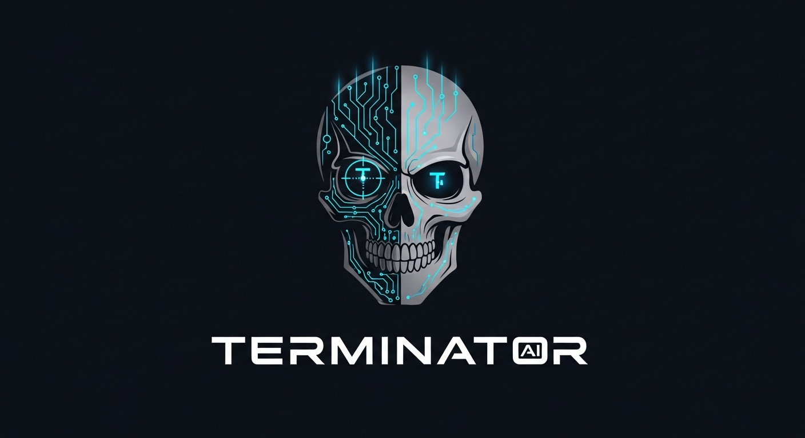
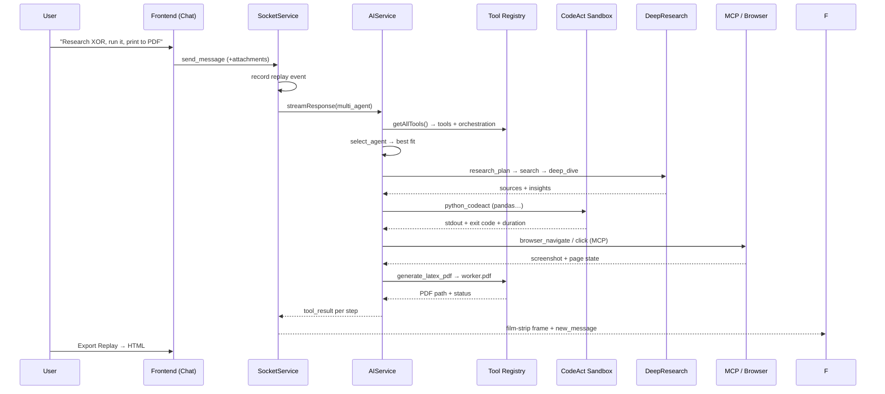
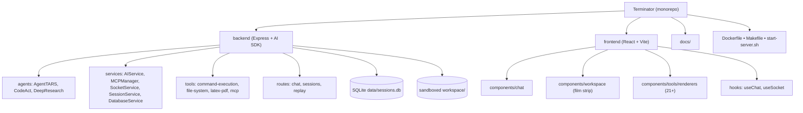

<div align="center">

  

  <h1 align="center">🤖 Terminator</h1>

  <p align="center"><b>The AI Automated Software Engineering Platform</b><br/>
  One agent that researches, browses, writes code, generates files, and ships work — end to end.</p>

  <p align="center">
    <a href="https://github.com/robloxsagax-web/Autopilot"></a>
    <a href="https://github.com/robloxsagax-web/Autopilot"></a>
    <a href="https://github.com/robloxsagax-web/Autopilot/issues"></a>
    <a href="https://github.com/robloxsagax-web/Autopilot/releases"></a>
    <a href="https://github.com/robloxsagax-web/Autopilot/blob/main/LICENSE"></a>
    <a href="https://github.com/robloxsagax-web/Autopilot/commits/main"></a>
  </p>

  <p align="center">
    
    
    
    
    
    
    
    
    
    
    
    
    
    
    
    
  </p>

</div>

---

## 📖 Table of Contents

- [What Is Terminator?](#-what-is-terminator)
- [Why Another AI Agent? — The Problem We Solve](#-why-another-ai-agent--the-problem-we-solve)
- [The Best of What's Inside](#-the-best-of-whats-inside)
- [Architecture](#️-architecture)
- [Tech Stack](#-tech-stack)
- [Getting Started](#-getting-started)
- [AI Providers](#-ai-providers)
- [Configuration Reference](#️-configuration-reference)
- [Docker Deployment](#-docker-deployment)
- [Compile to a Standalone Binary](#-compile-to-a-standalone-binary)
- [NPM Scripts](#-npm-scripts)
- [Project Structure](#️-project-structure)
- [API Overview](#-api-overview)
- [Documentation](#-documentation)
- [Roadmap](#️-roadmap)
- [License](#️-license)

---

## 🔍 What Is Terminator?

> **Terminator is an open-source, self-hosted AI software-engineering copilot.** It fuses a multi-agent reasoning system, a sandboxed code execution engine, a vision-capable browser automation layer, deep web research, and a cinematic "film strip" tool-result workspace into a single web application — so one natural-language request can turn into working code, a compiled PDF, a researched report, or a completed browser task, all inside one session.


### The shortest description

| Term | Does |
|---|---|
| **Agent orchestration** | A `multi_agent` brain that picks the right specialist (CodeAct, DeepResearch) per task and can coordinate them |
| **CodeAct engine** | Run real **JavaScript / Node.js, Python, and Shell** in isolated sandboxes with one-line dependency management (`npm` / `pip` and persisted memory) |
| **DeepResearch engine** | Plan-and-execute research across DuckDuckGo/Google/Bing with source tracking, insight extraction, and auto-generated reports |
| **Browser automation (MCP)** | Full vision-capable browser control via Model Context Protocol servers (`browser`, filesystem, memory,…`) — click, type, drag, hover, wait, extract, screenshot |
| **LaTeX PDF pipeline** | Turn plain LaTeX into a downloadable/inline-rendered PDF with zero extra tooling |
| **Session replay** | Every tool call is recorded into a film-strip timeline — scrub back, replay, and export a full self-contained **HTML replay** |
| **Real-time UX** | Streaming tokens via **Socket.IO + SSE**, file attachments, dark mode, glassmorphism UI, Monaco editor, Framer Motion |

---

## ❓ Why Another AI Agent? — The Problem We Solve

Everyone from students to startup engineers hits the same wall:

### 1. AI agents talk, but they don't *do*
Chatbots answer questions. Software engineering needs **effects** — writing files, running scripts, installing packages, browsing the web, generating artifacts. Most assistants stop atthe text. Terminator doesn't: every capability is a **tool that executes** and streams its real result back.

.

###2. Running code is dangerous and annoying
Executing LLM-generated code usually means copy-pasting into a terminal, guessing dependencies, polluting your machine. Terminator gives agents a **sandboxed workspace** (`workspace/`) with path-traversal guards, dangerous-command blocking, per-language isolation (node/ python/ shell), automatic dependency install, timeouts, real-time output streaming, and an optional **persistent memory** keyed by name across sessions.


###3. Research is shallow and unverifiable
Generic chatbots hallucinate one answer. Terminator runs a **plan-and-execute research loop**: structured plans (`create → complete_step → get`), multi-engine searches with domain filters, visits multiple sources, extracts insights by focus area, tracks source URLs, collects images, and assembles a cited report in Markdown/HTML/JSON. It's a first draft of a research paper, not a paragraph.


###4. Browsers are the real computer interface
Scraping and web automation are brittle in most agent tools. Terminator outsources browser control to **MCP servers** — an open standard — with vision-based control(`--vision`), reconnect/backoff handling, health checks, dynamic tool discovery, and management tools (`mcp_list_servers`, `mcp_configure`, …). That means browser actions show up as **visual steps with screenshots and mouse overlays** in the UI, not opaque JSON.


###5. You can't see what the agent is doing
Black-box agents feel untrustworthy. Terminator's **Workspace / Computer panel** renders every tool result into a contextual card — command output, code editor with syntax highlighting, search results with relevance scores, browser screenshots with cursor overlays, PDF previews — behind **film-strip playback controls** (play/pause, frame scrub, speed) so you can watch the agent work like a movie and export any session as a standalone HTML replay for demos, judges, or teammates.


###6. Deploying AI software is a pain
Dependencies, runtimes, browser binaries... Terminator ships as a **single compiled Bun binary** (`bun build --compile`) for Linux/macOS/Windows, a **Docker image** (even a full WebTop desktop with Terminator as a desktop app), and a `start-server.sh` that injects API keys via stdin so secrets never appear in `ps`. Run it anywhere.


###So, the problem Terminator solves is:

> **One self-hosted platform where an AI agent can do the *whole* software-engineering loop — plan, search, browse, write, execute, generate artifacts, and replay it all — without scattering yourwork across ten tools.**

---

## 🌟 The Best of What's Inside

### 🧠 Multi-Agent Orchestration (`AgentTARS`)
- Three agent archetypes: **AI Assistant** (all tools), **CodeAct Agent** (sandboxed code), **DeepResearch Agent** (plan-and-execute research).
- Automatic agent selection by task keywords, plus explicit tools to `select_agent`, `list_agents`, `switch_agent` (with context preservation), and `coordinate_agents` (dependency-graph execution ordering for sequential/parallel/dependency modes).

### ⚡ CodeAct Sandbox (`CodeActAgent`)
```ts
node_codeact:   run Node.js/JS  + `npm install` deps
python_codeact: run Python       + `pip install` packages
shell_codeact:  run bash/sh/zsh  + dangerous-command blocking
codeact_memory: persistent key/value memory across sessions
```
- Real-time stdout/stderr streaming, timeouts, exit codes, duration metadata, auto-installed dependencies, isolated per-language workspaces,and Monaco-based renderer with copy buttons.


### 🔬 DeepResearch Engine (`DeepResearchAgent`)
- `research_plan`: create/update/get research plans & sessions.
- `search`: DuckDuckGo/Google/Bing with domain `site:` filters and `-site:` exclusions, relevance scoring, instant-answer support.
- `visit_link` / `deep_dive`: multi-source analysis with focus-area insight extractionand URL deduplication.
- `report_generator`: **Markdown / HTML / JSON** reports from collected sources + images.
- `session_manager`: list / inspect / delete research sessions with stats (URLs visited, collections, images)..


### 🌐 Vision-Capable Browser Automation (MCP)
- Driven by the **Model Context Protocol** — connect any MCP server (stdio; SSE planned).
- Bundled default: `@agent-infra/mcp-server-browser@1.2.17 --vision`.
- **21+ specialized renderers** for browser results: click/double-click/right-click, hover, drag & drop, form fill/type, wait, extract/text/links/clickable-elements — each shown as a visual step.


### 🛠️ General Toolkit
- `web_search` (enhanced), `visit_link` (readability-extracted content via Turndown/Mozilla Readability), `file_read` / `list_files` / `create_directory` (sandboxed workspace), `execute_command` (shell selection, timeouts, security blocks), `generate_latex_pdf` (compiles `pdflatex` → PDF served at `/api/pdf/:name`)..


### 🎛️ Live IDE-Like Workspace Panel
- Three-panel layout: **Recent Tasks sidebar** (grouped Today / Yesterday / This Week, search, delete), **Chat** (streaming markdown, syntax-highlighted code blocks, token counts, copy), **Workspace/Computer** (film-strip timeline of tool results with playback controls, per-frame renderers).
- Gradient focus border on input, animated thinking dots, connection status banner, one-click **Export Replay**.


### 📼 Session Replay & Export
- Every `user_message`, `assistant_thinking`, `assistant_message`,and `tool_call` is recorded per session.
- Replay API: `GET /api/replay/sessions/:id/replay` (JSON) and `/export` (self-contained HTML with embedded data + timeline UI)..
- Sessions persist in **SQLite** (`data/sessions.db`) with indexes on session/message/tool-call and cascade deletes. Auto-generated titles from first message.


### 🛡️ Security-First Design
- Path validation — no directory traversal out of `workspace/`.
- Dangerous command blacklist (`rm -rf /`, `dd`, `mkfs`, `fork bomb`, …).
- Helmet CSP headers + CORS allow-listing.

- Sanitized PDF filenames (safe charset, `.pdf` enforced), 403 on escapeat.
- MCP connections with exponential backoff reconnect,max-retry caps, timeouts, health checks, and kill-switch (`enabled:false`)..
- `start-server.sh` feeds env vars via stdin temp file — **API keys never visible in process listings**.


### 🎨 Modern, Polished UI
- React 18 + TypeScript + Vite + Tailwind, React Router (shareable `/sessionId` URLs,, dark/light theme with `next-themes`,Framer Motion animations,,Monaco editor,,react-markdown + GFM + rehype-highlight,glassmorphism panes, macOS traffic-light header,gradient accent system.


---

## 🏗️ Architecture

### System Overview


###Multi-Agent Orchestration



### Repository Layout



---

## 🛠️ Tech Stack

| Layer | Technologies |
|---|---|
| **Language** | TypeScript (strict), ESM |
| **Runtime / Tooling** | Bun ≥ 1.0, Node ≥ 18, pnpm workspaces |
| **Backend** | Express 4, Socket.IO 4, Helmet, CORS, Vercel AI SDK (`ai`),@ai-sdk/{openai,anthropic,google},@openrouter/ai-sdk-provider,ollama-ai-provider |
| **Sandbox execution** | `child_process` spawn with timeouts, isolated workspaces, auto `npm` / `pip` installs |
| **Database** | SQLite via `bun:sqlite` (sessions, messages, tool_calls with indexes) |
| **Research** | DuckDuckGo Instant Answer API, Mozilla Readability, Turndown (HTML→Markdown), jsdom |
| **Browser / MCP** | `@modelcontextprotocol/sdk`, `@agent-infra/browser`, stdio transport, `puppeteer` |
| **PDF** | `pdflatex` (LaTeX → PDF), streamed via Express |
| **Frontend** | React 18, Vite 7, Tailwind CSS 3, Framer Motion, react-router-dom, jotai, react-markdown, react-syntax-highlighter, Monaco Editor, socket.io-client, next-themes |
| **Validation** | Zod schemas on every tool parameter |
| **Deploy** | Docker (WebTop desktop), Bun `--compile` standalone binaries, GitHub Actions release pipeline |

---

## 🚀 Getting Started

### Prerequisites

- **[Bun](https://bun.sh/docs/installation)** `>= 1.0` (runtime + package manager + bundler)
- **Node.js** `>= 18`
- **One AI provider API key** (Anthropic, OpenAI, Google, OpenRouter — or a local Ollama server)
- *(optional)* `pdflatex` for the LaTeX PDF tool

###1. Clone

```bash
git clone https://github.com/robloxsagax-web/Autopilot.git
cd Autopilot
```

###2. Install dependencies

```bash
bun install
```

> Workspaces (`frontend`, `backend`) install together. On resource-constrained CI you can skip the Chromium download: `PUPPETEER_SKIP_DOWNLOAD=true bun install`.

###3. Configure environment

```bash
cp .env.example .env
```

Minimal Anthropic example:

```bash
AI_MODEL=claude-sonnet-4-20250514
AI_PROVIDER=anthropic
ANTHROPIC_API_KEY=sk-ant-...
```

###4. Start

```bash
bun run dev:watch
```

That runs the backend (`bun --watch`, port **3001**) and hot-rebuilds the frontend into `backend/public`, served by the same Express server.


###5. Open the app

| URL | What |
|---|---|
| http://localhost:9005 | Frontend dev server (Vite proxy → backend) |
| http://localhost:3001 | Backend API + Socket.IO + served frontend |
| http://localhost:3001/health | Health check |

**Ports:** backend `PORT` (default `3001`), frontend dev `9005`, WebTop Docker desktop `6901`.

### Quick smoke test

```bash
curl http://localhost:3001/health
# {"status":"healthy","timestamp":"…","version":"1.0.0"}
```

---

## 🧠 AI Providers

| Provider | `.env` |
|---|---|
| **Anthropic Claude** | `AI_PROVIDER=anthropic` · `AI_MODEL=claude-sonnet-4-20250514` · `ANTHROPIC_API_KEY=…` |
| **OpenAI GPT** | `AI_PROVIDER=openai` · `AI_MODEL=gpt-4o` · `OPENAI_API_KEY=…` |
| **OpenAI-compatible (LiteLLM / vLLM / LocalAI)** | add `OPENAI_BASE_URL=http://host:4000` |
| **Google Gemini** | `AI_PROVIDER=google` · `AI_MODEL=gemini-1.5-pro` · `GOOGLE_GENERATIVE_AI_API_KEY=…` |
| **Ollama (local, free)** | `AI_PROVIDER=ollama` · `AI_MODEL=llama3.1:8b` (no key — run `ollama serve`) |
| **OpenRouter (one key, many models)** | `AI_PROVIDER=openrouter` · `AI_MODEL=anthropic/claude-3.5-sonnet` · `OPENROUTER_API_KEY=…` |

Full provider guide: [docs/AI_PROVIDERS.md](docs/AI_PROVIDERS.md)

---

## ⚙️ Configuration Reference

| Variable | Default | Purpose |
|---|---|---|
| `AI_PROVIDER` | *(required)* | `anthropic` , `openai` , `google` , `ollama` , `openrouter` |
| `AI_MODEL` | *(required)* | Model id per provider |
| `ANTHROPIC_API_KEY` / `OPENAI_API_KEY` / `GOOGLE_GENERATIVE_AI_API_KEY` / `OPENROUTER_API_KEY` | — | Provider keys (Ollama needs none) |
| `OPENAI_BASE_URL` | — | Custom OpenAI-compatible endpoint (LiteLLM, vLLM, LocalAI…) |
| `AI_TEMPERATURE` | `0.7` | Sampling temperature |
| `AI_MAX_TOKENS` | `4000` | Max tokens per response |
| `PORT` | `3001` | Backend / API port |
| `FRONTEND_URL` | `http://localhost:9005` | CORS / Socket.IO origin |
| `NODE_ENV` | `development` | Runtime mode |
| `WORKSPACE_PATH` | `./workspace` | Sandbox root for file/code tools |
| `MCP_CONFIG_PATH` | `./mcp-config.json` | MCP server definitions |
| `DATABASE_PATH` | `./data/sessions.db` | SQLite file location |

See also [docs/CONFIGURATION.md](docs/CONFIGURATION.md.

---

## 🐳 Docker Deployment

Two flavors:

### A. Standalone (quickest)

```yaml
# docker-compose.yml (already included)
services:
  terminator:
    build: .
    ports:
      - "6901:6901"   # WebTop desktop
      - "9005:9005"   # Terminator UI
    volumes:
      - ./config:/config
      - /var/run/docker.sock:/var/run/docker.sock # optional
    shm_size: "1gb"   # headroom for Chromium
    environment:
      - PUID=1000
      - PGID=1000
      - TZ=Etc/UTC
    security_opt: [seccomp:unconfined] # optional, browser sandbox
```

```bash
docker-compose build && docker-compose up -d
```

Open `http://localhost:6901` for the **full Linux desktop** (KDE), double-click the **Terminator** shortcut, or run `/app/start-terminator.sh` — your AI platform lands at `http://localhost:9005`.

Mount your key:

```yaml
volumes:
  - ./.env:/app/terminator/.env
```

###B. Binary-style image

Compile a standalone binary (below), place it in `dist/terminator-linux`, then `docker build` — the image runs `./dist/terminator-linux` with Chromium preinstalled (`PUPPETEER_EXECUTABLE_PATH` set), desktop shortcut included..

Full walkthrough: [DOCKER.md](DOCKER.md.


---

## 💾 Compile to a Standalone Binary

Bun can embed the **entire backend into a single executable** — no Node install needed on the target machine:

```bash
# 1) Build the frontend into backend/public
bun run build

# 2) Compile the server (cross-platform targets)
mkdir -p ./dist
bun run compile:linux    # bun-linux-x64
bun run compile:windows  # bun-windows-x64
# …or add bun run compile:mac for darwin

# Manual:
bun build backend/src/index.ts --compile --target=bun-linux-x64 --external puppeteer --outfile=./dist/iris-server-linux

# 3) Ship it with the static frontend
cp -r backend/public ./dist/
```

The GitHub Actions release workflow (`release.yml`) already builds **4 binaries** (Linux x64/arm64, macOS x64/arm64) + frontend tarball on every `main` push and attaches them to a `v<N>` release.


---

## 📦 NPM Scripts

| Script | Description |
|---|---|
| `bun run dev` | Run backend + frontend dev servers concurrently |
| `bun run dev:watch` | Backend watch + auto-rebuild frontend on change (recommended) |
| `bun run build` | Build frontend → `backend/public` |
| `bun run start` | Start the compiled/backend server |
| `bun run compile` | Build frontend + compile full server binary (excludes puppeteer) |
| `bun run compile:linux` / `compile:windows` | Cross-compile standalone binaries |
| `bun run lint` / `type-check` / `test` | Quality gates across workspaces |
| `bun run clean` | Clean all workspace artifacts |
| `./start-server.sh` | Secure startup — API key via stdin, never in `ps` |
| `./kill-port.sh <port>` | Kill whatever sits on a port |
| `./convert-demo.sh <video>` | Rebuild `demo.gif` from an MP4 |

---

## 🗂️ Project Structure

```
.
├── backend/                  # Express + AI SDK server (Bun)
│   ├── mcp-config.json         # MCP server definitions (browser, …)
│   ├── src/
│   │   ├── index.ts            # Entry: Express,Socket.IO,CSP,PDF serving
│   │   ├── agents/
│   │   │   ├── AgentTARS.ts   # multi-agent orchestration + selection
│   │   │   ├── CodeActAgent.ts # sandboxed code execution (node/python/shell)
│   │   │   ├── DeepResearchAgent.ts # plan-and-execute research engine
│   │   │   └── research/       # search, deep-dive, report generator, sessions
│   │   ├── services/
│   │   │   ├── AIService.ts    # streaming/generate via Vercel AI SDK
│   │   │   ├── MCPManager.ts   # MCP lifecycle: connect, retry, execute
│   │   │   ├── SocketService.ts # real-time streaming + replay event capture
│   │   │   ├── SessionService.ts# session CRUD + auto titles
│   │   │   └── DatabaseService.ts # SQLite schema + indexes
│   │   ├── routes/             # chat, sessions, replay (JSON + HTML export)
│   │   ├── config/providers.ts # provider validation (5 providers)
│   │   └── services/tools/     # command-execution, file-system, latex-pdf, mcp
│   └── workspace/             # sandbox for agent file/code ops
├── frontend/                   # React 18 + Vite + Tailwind (builds → backend/public)
│   └── src/
│       ├── components/
│       │   ├── chat/          # ChatInterface, ChatInput, ChatMessage (MD + code)
│       │   ├── workspace/     # film-strip WorkspacePanel + playback hooks
│       │   ├── tools/renderers/# 21+ result renderers (browser, codeact,
│       │   │                   #  deep-research, pdf, command, json, search…)
│       │   └── layout/ sidebar/ ui/ about/
│       └── hooks/ lib/ contexts/ # useChat, useSocket, socket client, theme
├── docs/                       # architecture, providers, config, api, getting-started
├── Dockerfile                  # WebTop KDE desktop image w/ Terminator
├── docker-compose.yml
├── .github/workflows/release.yml # auto release + 4 binaries on every push
├── Makefile                    # docker build/push/exec helpers
└── demo.gif                    # the demo — keep it
```

---

## 🔌 API Overview

| Method | Route | Purpose |
|---|---|---|
| `GET` | `/health` | Liveness + version |
| `POST` | `/api/chat/message` | Send message (`{sessionId, message, stream?}`; SSE stream supported) |
| `GET` | `/api/chat/config` · `POST` `/api/chat/config` | Read / hot-update AI model config |
| `GET` | `/api/sessions` · `POST` `/api/sessions` | List / create sessions |
| `GET` | `/api/sessions/:id` · `PUT` `:id` | Read / update session (title) |
| `GET` | `/api/replay/sessions/:id/replay` | Full replay timeline (JSON) |
| `GET` | `/api/replay/sessions/:id/export` | Download self-contained HTML replay |
| `GET` | `/api/pdf/:filename` | Stream a generated PDF (path-traversal-safe) |

**Socket.IO events** (`/socket.io`)`: `create_session`, `join_session`, `leave_session`, `send_message`, `get_sessions`, `delete_session` → `new_message`, `message_chunk`, `assistant_thinking`, `tool_result`, `session_messages`, `session_created`, … All session events are recorded for replay..

Full reference: [docs/API_REFERENCE.md](docs/API_REFERENCE.md.


---

## 📚 Documentation

- [Introduction](docs/INTRODUCTION.md)
- [Getting Started](docs/GETTING_STARTED.md)
- [Configuration](docs/CONFIGURATION.md)
- [Features](docs/FEATURES.md)
- [Project Architecture](docs/PROJECT_ARCHITECTURE.md)
- [AI Providers](docs/AI_PROVIDERS.md)
- [API Reference](docs/API_REFERENCE.md)
- [MCP Integration](backend/MCP_INTEGRATION.md)
- [Docker Setup](DOCKER.md)

---

## 🗺️ Roadmap

- [ ] SSE transport for remote MCP servers (URL-based, auth headers)
- [ ] Per-agent memory pipelines shared across CodeAct / DeepResearch sessions
- [ ] GUI automation agent (vision-first, like UI-TARS)
- [ ] Multi-user auth (sessions scoped per user)
- [ ] RAG / knowledge-graph backend (SQLite vector search)
- [ ] One-click "Ship" flow: agent → PR/artifact → deployed demo
- [ ] Ollama model health probing before agent selection
- [ ] Recording: playback for full browser sessions (RRWeb-style)

---

## ⚖️ License

Released under the [MIT License](./LICENSE.


<sub>Builtfor the **Best Automated Software Engineering Project** track — where agents don't just answer, they build.</sub>